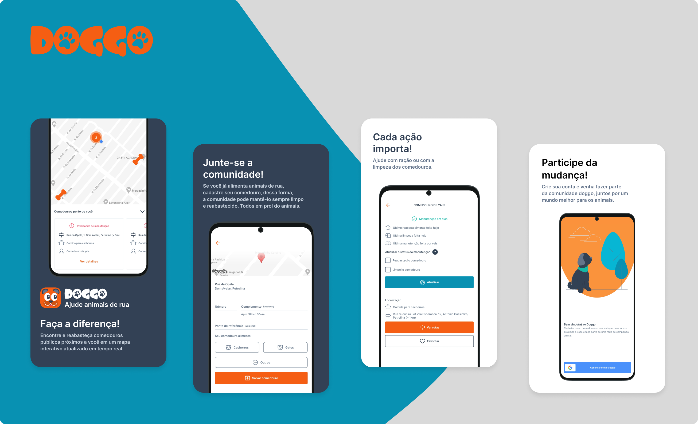

<h1 align="center">doggo - Ajude animais de rua</h1>

  

---

## Apresentação | 📖

O Doggo é um aplicativo dedicado a facilitar a alimentação de animais de rua. Nele, é possível que usuários encontrem comedouros públicos próximos em um mapa interativo atualizado em tempo real ou cadastrem seus próprios comedouros para serem reabastecidos pela comunidade.

## Pré-Requisitos | ⚙️

Em desenvolvimento...

## Guia de Instalação | 🔨

Em desenvolvimento...

## Executando os Testes | 🧪

Em desenvolvimento...

## Tecnologias Utilizadas | 📦

Em desenvolvimento...

## Como contribuir | 🤝

Em Desenvolvimento...

---

Com 🧡 por <a href="https://www.linkedin.com/in/johelder/">Johelder</a>

